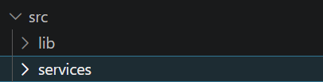
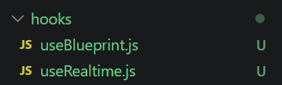
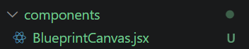
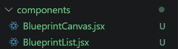
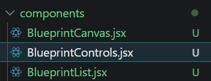
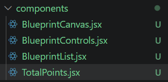
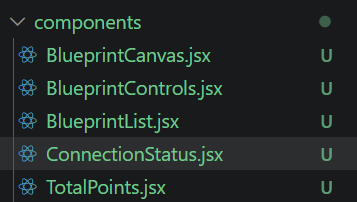
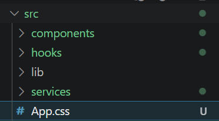
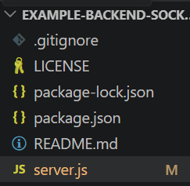

# Lab P4 — BluePrints en Tiempo Real (Sockets & STOMP)

> **Repositorio:** `DECSIS-ECI/Lab_P4_BluePrints_RealTime-Sokets`  
> **Front:** React + Vite (Canvas, CRUD, y selector de tecnología RT)  
> **Backends guía (elige uno o compáralos):**
> - **Socket.IO (Node.js):** https://github.com/DECSIS-ECI/example-backend-socketio-node-/blob/main/README.md
> - **STOMP (Spring Boot):** https://github.com/DECSIS-ECI/example-backend-stopm/tree/main

## 🎯 Objetivo del laboratorio
Implementar **colaboración en tiempo real** para el caso de BluePrints. El Front consume la API CRUD de la Parte 3 (o equivalente) y habilita tiempo real usando **Socket.IO** o **STOMP**, para que múltiples clientes dibujen el mismo plano de forma simultánea.

Al finalizar, el equipo debe:
1. Integrar el Front con su **API CRUD** (listar/crear/actualizar/eliminar planos, y total de puntos por autor).
2. Conectar el Front a un backend de **tiempo real** (Socket.IO **o** STOMP) siguiendo los repos guía.
3. Demostrar **colaboración en vivo** (dos pestañas navegando el mismo plano).

---

## 🧩 Alcance y criterios funcionales
- **CRUD** (REST):
  - `GET /api/blueprints?author=:author` → lista por autor (incluye total de puntos).
  - `GET /api/blueprints/:author/:name` → puntos del plano.
  - `POST /api/blueprints` → crear.
  - `PUT /api/blueprints/:author/:name` → actualizar.
  - `DELETE /api/blueprints/:author/:name` → eliminar.
- **Tiempo real (RT)** (elige uno):
  - **Socket.IO** (rooms): `join-room`, `draw-event` → broadcast `blueprint-update`.
  - **STOMP** (topics): `@MessageMapping("/draw")` → `convertAndSend(/topic/blueprints.{author}.{name})`.
- **UI**:
  - Canvas con **dibujo por clic** (incremental).
  - Panel del autor: **tabla** de planos y **total de puntos** (`reduce`).
  - Barra de acciones: **Create / Save/Update / Delete** y **selector de tecnología** (None / Socket.IO / STOMP).
- **DX/Calidad**: código limpio, manejo de errores, README de equipo.

---

## 🏗️ Arquitectura (visión rápida)

```
React (Vite)
 ├─ HTTP (REST CRUD + estado inicial) ───────────────> Tu API (P3 / propia)
 └─ Tiempo Real (elige uno):
     ├─ Socket.IO: join-room / draw-event ──────────> Socket.IO Server (Node)
     └─ STOMP: /app/draw -> /topic/blueprints.* ────> Spring WebSocket/STOMP
```

**Convenciones recomendadas**  
- **Plano como canal/sala**: `blueprints.{author}.{name}`  
- **Payload de punto**: `{ x, y }`

---

## 📦 Repos guía (clona/consulta)
- **Socket.IO (Node.js)**: https://github.com/DECSIS-ECI/example-backend-socketio-node-/blob/main/README.md  
  - *Uso típico en el cliente:* `io(VITE_IO_BASE, { transports: ['websocket'] })`, `join-room`, `draw-event`, `blueprint-update`.
- **STOMP (Spring Boot)**: https://github.com/DECSIS-ECI/example-backend-stopm/tree/main  
  - *Uso típico en el cliente:* `@stomp/stompjs` → `client.publish('/app/draw', body)`; suscripción a `/topic/blueprints.{author}.{name}`.

---

## ⚙️ Variables de entorno (Front)
Crea `.env.local` en la raíz del proyecto **Front**:
```bash
# REST (tu backend CRUD)
VITE_API_BASE=http://localhost:8080

# Tiempo real: apunta a uno u otro según el backend que uses
VITE_IO_BASE=http://localhost:3001     # si usas Socket.IO (Node)
VITE_STOMP_BASE=http://localhost:8080  # si usas STOMP (Spring)
```
En la UI, selecciona la tecnología en el **selector RT**.

---

## 🚀 Puesta en marcha

### 1) Backend RT (elige uno)

**Opción A — Socket.IO (Node.js)**  
Sigue el README del repo guía:  
https://github.com/DECSIS-ECI/example-backend-socketio-node-/blob/main/README.md
```bash
npm i
npm run dev
# expone: http://localhost:3001
# prueba rápida del estado inicial:
curl http://localhost:3001/api/blueprints/juan/plano-1
```

**Opción B — STOMP (Spring Boot)**  
Sigue el repo guía:  
https://github.com/DECSIS-ECI/example-backend-stopm/tree/main
```bash
./mvnw spring-boot:run
# expone: http://localhost:8080
# endpoint WS (ej.): /ws-blueprints
```

### 2) Front (este repo)
```bash
npm i
npm run dev
# http://localhost:5173
```
En la interfaz: selecciona **Socket.IO** o **STOMP**, define `author` y `name`, abre **dos pestañas** y dibuja en el canvas (clics).

---

## 🔌 Protocolos de Tiempo Real (detalle mínimo)

### A) Socket.IO
- **Unirse a sala**
  ```js
  socket.emit('join-room', `blueprints.${author}.${name}`)
  ```
- **Enviar punto**
  ```js
  socket.emit('draw-event', { room, author, name, point: { x, y } })
  ```
- **Recibir actualización**
  ```js
  socket.on('blueprint-update', (upd) => { /* append points y repintar */ })
  ```

### B) STOMP
- **Publicar punto**
  ```js
  client.publish({ destination: '/app/draw', body: JSON.stringify({ author, name, point }) })
  ```
- **Suscribirse a tópico**
  ```js
  client.subscribe(`/topic/blueprints.${author}.${name}`, (msg) => { /* append points y repintar */ })
  ```

---

## 🧪 Casos de prueba mínimos
- **Estado inicial**: al seleccionar plano, el canvas carga puntos (`GET /api/blueprints/:author/:name`).  
- **Dibujo local**: clic en canvas agrega puntos y redibuja.  
- **RT multi-pestaña**: con 2 pestañas, los puntos se **replican** casi en tiempo real.  
- **CRUD**: Create/Save/Delete funcionan y refrescan la lista y el **Total** del autor.

---

## 📊 Entregables del equipo
1. Código del Front integrado con **CRUD** y **RT** (Socket.IO o STOMP).  
2. **Video corto** (≤ 90s) mostrando colaboración en vivo y operaciones CRUD.  
3. **README del equipo**: setup, endpoints usados, decisiones (rooms/tópicos), y (opcional) breve comparativa Socket.IO vs STOMP.

---

## 🧮 Rúbrica sugerida
- **Funcionalidad (40%)**: RT estable (join/broadcast), aislamiento por plano, CRUD operativo.  
- **Calidad técnica (30%)**: estructura limpia, manejo de errores, documentación clara.  
- **Observabilidad/DX (15%)**: logs útiles (conexión, eventos), health checks básicos.  
- **Análisis (15%)**: hallazgos (latencia/reconexión) y, si aplica, pros/cons Socket.IO vs STOMP.

---

## 🩺 Troubleshooting
- **Pantalla en blanco (Front)**: revisa consola; confirma `@vitejs/plugin-react` instalado y que `AppP4.jsx` esté en `src/`.  
- **No hay broadcast**: ambas pestañas deben hacer `join-room` al **mismo** plano (Socket.IO) o suscribirse al **mismo tópico** (STOMP).  
- **CORS**: en dev permite `http://localhost:5173`; en prod, **restringe orígenes**.  
- **Socket.IO no conecta**: fuerza transporte WebSocket `{ transports: ['websocket'] }`.  
- **STOMP no recibe**: verifica `brokerURL`/`webSocketFactory` y los prefijos `/app` y `/topic` en Spring.

---

## 🔐 Seguridad (mínimos)
- Validación de payloads (p. ej., zod/joi).  
- Restricción de orígenes en prod.  
- Opcional: **JWT** + autorización por plano/sala.

---

## 📄 Licencia
MIT (o la definida por el curso/equipo).

---

## Frontend Completo

### Servicio CRUD

Creamos services:



Hook para manejar el estado del plano:


Hook para manejar la conexión en tiempo real:



Componente del Canvas:



Lista de planos:



Controles CRUD:



Total de puntos:



Estado de conexión:



Estilos:



---

### Actualizar Backend para soportar CRUD

El backend actual solo tiene GET. Vamos a actualizarlo para soportar todas las operaciones CRUD:

Actualizamos el server.js:



---

### Ejecucion 

### Terminal 1 - Backend
cd Ruta
npm install
npm run dev

### Terminal 2 - Frontend
cd Ruta
npm install
npm run dev

### Video prueba


### Resumen del Proyecto
BluePrints RT es una aplicación de colaboración en tiempo real para dibujo de planos arquitectónicos. Permite a múltiples usuarios dibujar simultáneamente sobre el mismo plano, con soporte para dos tecnologías de comunicación en tiempo real: Socket.IO y STOMP.

### Variables de Entorno
`.env.local`

VITE_API_BASE=http://localhost:3001      # API REST (CRUD)

VITE_IO_BASE=http://localhost:3001       # Socket.IO Server

VITE_STOMP_BASE=http://localhost:8080    # STOMP Server (Spring)

### Endpoints
`REST API (CRUD)`

| Método | Endpoint | Descripción |
|---------|----------|-------------|
| GET | `/api/blueprints?author=:author` | Lista todos los planos de un autor. |
| GET | `/api/blueprints/:author/:name` | Obtiene un plano específico. |
| POST | `/api/blueprints` | Crea un nuevo plano. |
| PUT | `/api/blueprints/:author/:name` | Actualiza un plano existente. |
| DELETE | `/api/blueprints/:author/:name` | Elimina un plano. |

### Eventos en Tiempo Real

Socket.IO

### Eventos Cliente → Servidor

| Evento | Descripción |
|---------|-------------|
| `join-room` | Unirse a una sala específica. |
| `draw-event` | Enviar un punto o trazo de dibujo al servidor. |

### Eventos Servidor → Cliente

| Evento | Descripción |
|---------|-------------|
| `blueprint-update` | Recibir actualizaciones del dibujo en tiempo real. |

STOMP

| Destino | Descripción |
|----------|-------------|
| `/app/draw` | Enviar un punto o trazo de dibujo al servidor. |
| `/topic/blueprints.{author}.{name}` | Suscribirse para recibir actualizaciones de un plano específico en tiempo real. |

### Decisiones de Diseño

**Rooms vs Tópicos**

Socket.IO - Rooms

Decisión: Usar rooms para aislar la comunicación por plano.

Ventajas:
- Aislamiento automático: Cada sala es independiente
- Sencillez: No requiere gestión de suscripciones
- Eficiencia: El broadcast se limita a los miembros de la sala
- Integración natural: Socket.IO maneja la gestión de salas automáticamente

STOMP - Tópicos

Decisión: Usar tópicos jerárquicos para identificar cada plano.

Ventajas:
- Estándar: Sigue el protocolo STOMP
- Flexibilidad: Permite patrones de suscripción más complejos
- Escalabilidad: Mejor para sistemas distribuidos
- Compatibilidad: Funciona con brokers como RabbitMQ, ActiveMQ

## Comparativa: Socket.IO vs STOMP

| Aspecto | Socket.IO | STOMP |
|----------|-----------|--------|
| Protocolo | WebSocket con fallbacks | Simple Text Oriented Messaging Protocol |
| Complejidad | Baja - API simple y directa | Media - requiere entender el protocolo |
| Manejo de Salas/Tópicos | Salas (rooms) integradas de forma nativa | Basado en broker y suscripciones explícitas |
| Reconexión | Automática con backoff | Manual, requiere implementación adicional |
| Uso Típico | Aplicaciones web en tiempo real | Sistemas empresariales y microservicios |
| Ventajas | Fácil de usar, buena documentación y gran comunidad | Estándar, interoperable y escalable |
| Desventajas | Menos estandarizado y dependiente de la librería | Mayor curva de aprendizaje y configuración adicional |